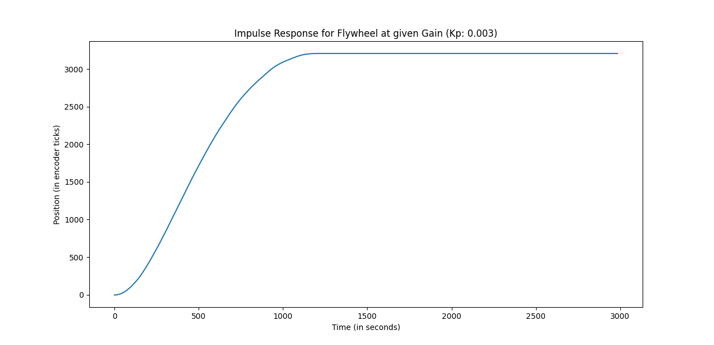
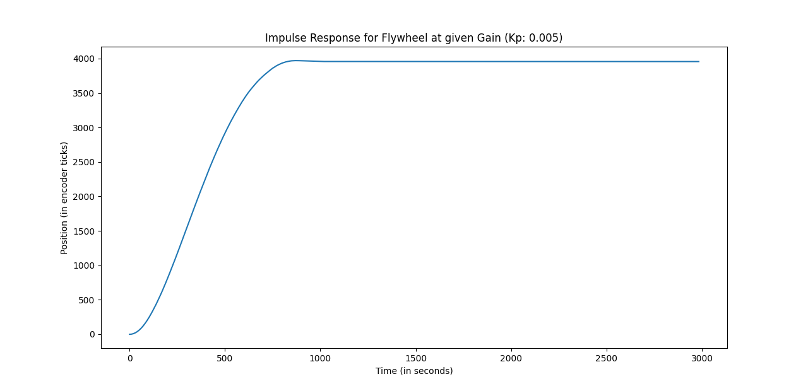
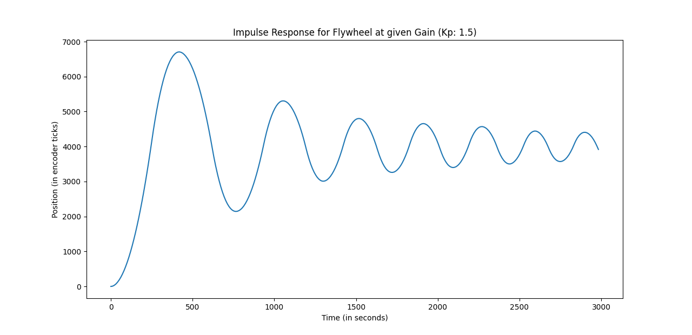

# ME 405 Lab 2

This directory contains files for closed loop control of a ME405 kit. Our closed loop contoller sets the motor to a specified encoder position. The gain for the controlled is specified by the user. The program then runs for three seconds with the specified gain. The values are the printed and output to the serial communication, where it is read by Serial_plotter.py, which then plots the data from the motor.

The controller takes data from each time it runs, and it runs every 10ms. The data collected is the current position of the encoder and the time since it has started running. These values are reset for every run of the closed loop system. For testing purposes, the encoder target was always 4000 encoder units.

The time for all graphs is in milliseconds rather than seconds as stated.

This graph shows the step response of our motor at Kp=.003 with a target setpoint of 4000 encoder units. This is the overdampped response of the motor system. The system does not reach the target value and reaches steady state much slower than when critically dampped.

This graph shows the step response of our motor at Kp=.005 with a target setpoint of 4000 encoder units. This is the critically dampped responose of the motor system. The motor gets much closer to 4000 encoder units and reaches it relatively quickly.

This graph show the step response of our motor at Kp=1.5 with a target setpoint of 4000 encoer units. This it the underdampped response where the motor overshoots then attempts to correct itself. This oscillation continues until a steady state is reached.